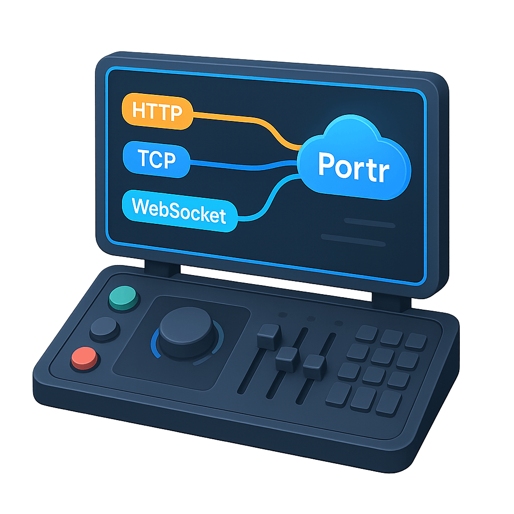

<div align="center">
  
</div>

<br />

<div align="center">
  
  
  <a href="https://portr.dev" target="_blank"></a>
</div>

<br />

Portr is a tunnel solution that allows you to expose local http, tcp or websocket connections to the public internet. It utilizes SSH remote port forwarding under the hood to securely tunnel connections.

Portr is primarily designed for small teams looking to expose development servers on a public URL. It is not recommended for use alongside production servers.

## Features

- 🎉 Expose local HTTP, TCP, and WebSocket services on public URLs.
- 🚨 Built-in local inspector on `http://localhost:7777` for request inspection, replay, and WebSocket session debugging. [Watch video](https://www.youtube.com/watch?v=_4tipDzuoSs).
- 🤖 Agent-friendly local request logs with `portr logs`, backed by `~/.portr/db.sqlite`.
- 👾 Admin dashboard for team, user, and connection management. [Watch video](https://www.youtube.com/watch?v=Wv5j3YQk3Ew).

## Quick Start

1. Set up a Portr server or use an existing one.
2. Install the Portr client on your machine.
3. Start a local service, then expose it:

```bash
portr http 9000
```

To pin the tunnel to a subdomain:

```bash
portr http 9000 --subdomain amal-test
```

Starting an HTTP tunnel does three useful things immediately:

- Creates a public HTTPS URL that forwards to your local service.
- Starts the Portr inspector locally at [http://localhost:7777](http://localhost:7777).
- Persists HTTP request logs locally so they can be queried from the CLI.

## Inspector And Logs

The local inspector lets you:

- inspect incoming HTTP requests and responses
- replay stored requests
- inspect headers and payloads
- monitor upgraded WebSocket sessions and captured frames

The same stored request data is available from the CLI:

```bash
# Show the latest logs for a subdomain
portr logs amal-test

# Filter by URL substring
portr logs amal-test /api/

# Emit the full stored records as JSON
portr logs amal-test --json
```

## Setup

- [Server setup guide](https://portr.dev/docs/server)
- [Client installation guide](https://portr.dev/docs/client/installation)
- [HTTP tunnel guide](https://portr.dev/docs/client/http-tunnel)
- [Getting started guide](https://portr.dev/docs/getting-started)

## Contributing

Please read through [our contributing guide](.github/contributing.md) and set up your [development environment](https://portr.dev/docs/local-development).

## License

This project is licensed under the GNU Affero General Public License v3.0 (AGPL-3.0). See the  [LICENSE](/LICENSE) file for the full license text.
