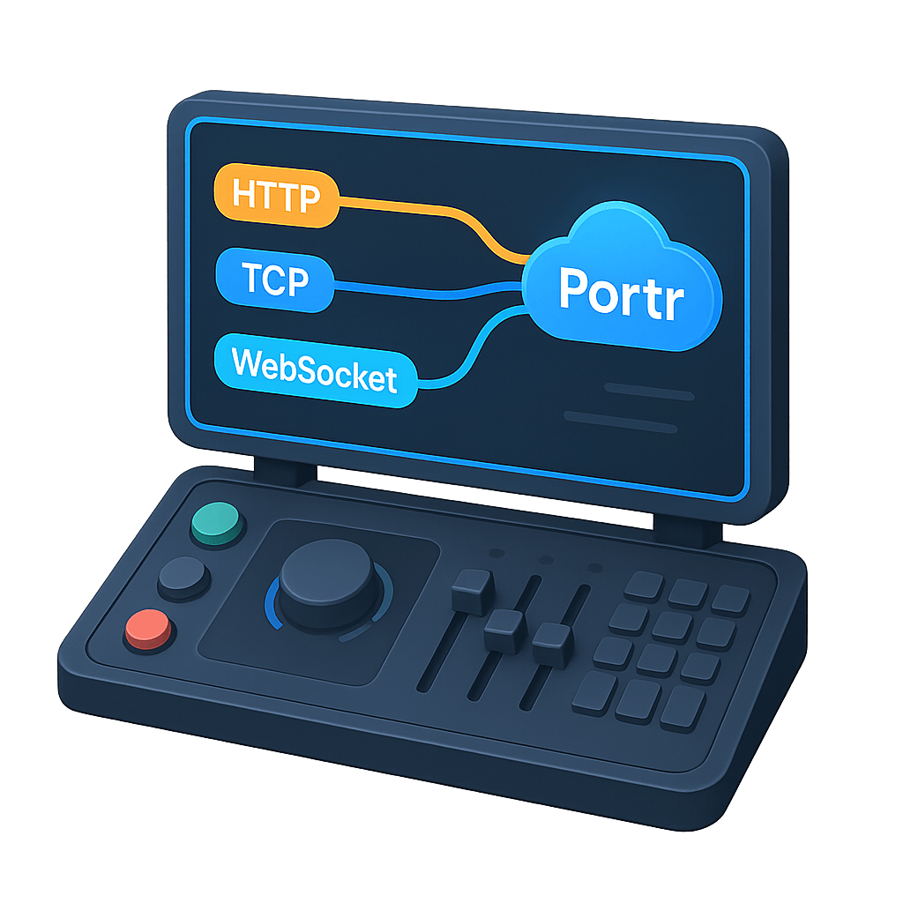

  

 

  
  
  

 

Portr is a tunnel solution that allows you to expose local http, tcp or websocket connections to the public internet. It utilizes SSH remote port forwarding under the hood to securely tunnel connections.

Portr is primarily designed for small teams looking to expose development servers on a public URL. It is not recommended for use alongside production servers.

> [!WARNING]
> Portr is currently in beta. Expect bugs and anticipate breaking changes.

## Features

- 🎉 Easily tunnel http, tcp or websocket connections.
- 👾 Admin dashboard for team/user management. [Watch video](https://www.youtube.com/watch?v=Wv5j3YQk3Ew).
- 🚨 Portr inspector for inspecting and replaying requests. [Watch video](https://www.youtube.com/watch?v=_4tipDzuoSs).

## Setup

- [Server setup guide](https://portr.dev/docs/server)
- [Client installation guide](https://portr.dev/docs/client/installation)

## Contributing

Please read through [our contributing guide](.github/contributing.md) and set up your [development environment](https://portr.dev/local-development/admin/).

## License

This project is licensed under the GNU Affero General Public License v3.0 (AGPL-3.0). See the  [LICENSE](/LICENSE) file for the full license text.
