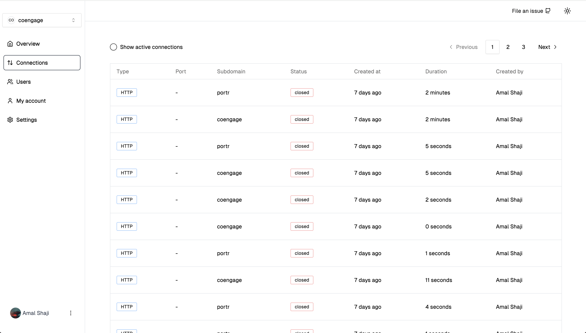
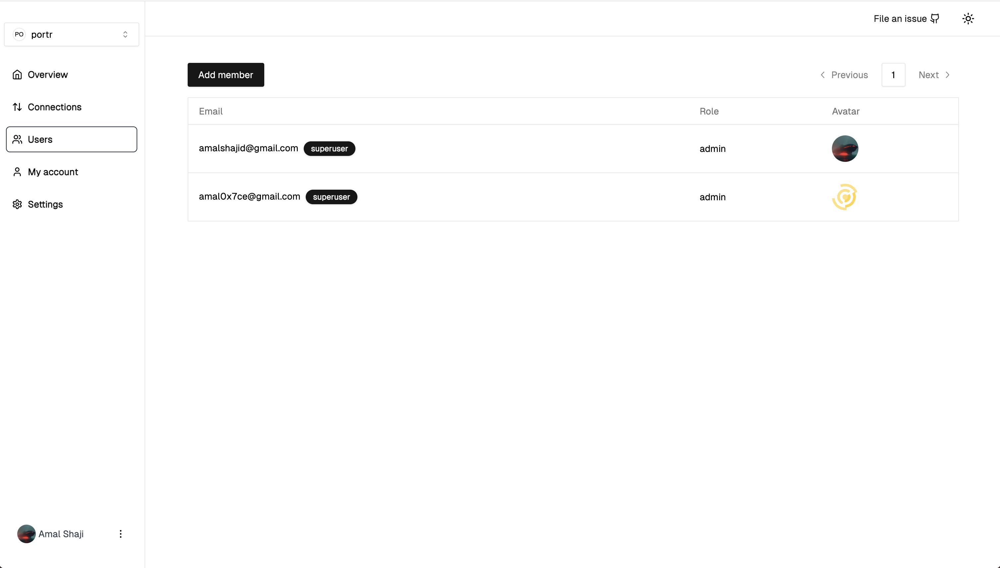

Portr is a self-hosted tunnel solution designed for teams. It lets you expose local http/tcp connections to the internet.

You can use the client to quickly tunnel http/tcp connections

```bash
portr http 9000
```

This command exposes your local http server running at port `9000` on a public https url.

The admin let's you monitor connections and managed team members.

#### Monitor connections



#### Manage team members



import { Card, CardGrid } from "@astrojs/starlight/components";

### Next steps

- [Server setup](/server-setup)
- [Client setup](/client-setup)
