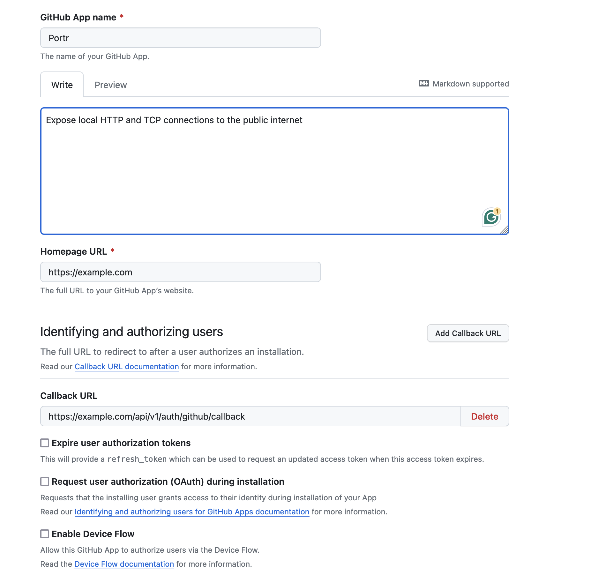
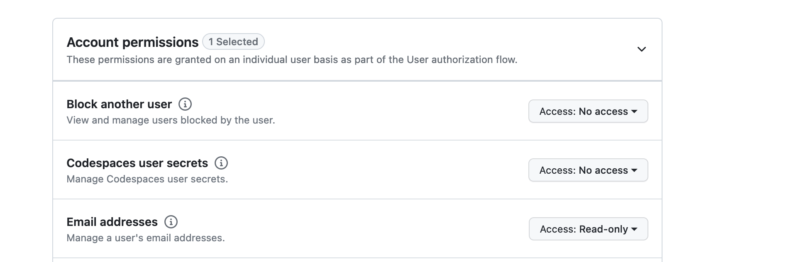

import { Aside } from '@astrojs/starlight/components';

<Aside>We'll be creating a Github app and not an Oauth app, because the Github app will be used to manage users for a team(add/remove users)</Aside>

Github app is required for the users to login to the admin server.

For the rest of this guide, we'll assume `example.com` as your domain.

- Go to [https://github.com/settings/apps](https://github.com/settings/apps)
- Create a new github app
- Enter the homepage URL as [https://example.com](https://example.com)
- Enter the callback URL as [https://example.com/api/v1/auth/github/callback](https://example.com/api/v1/auth/github/callback)

- Under account permissions tab, choose `read-only` access for email addresses

- Click on `Create Github App`