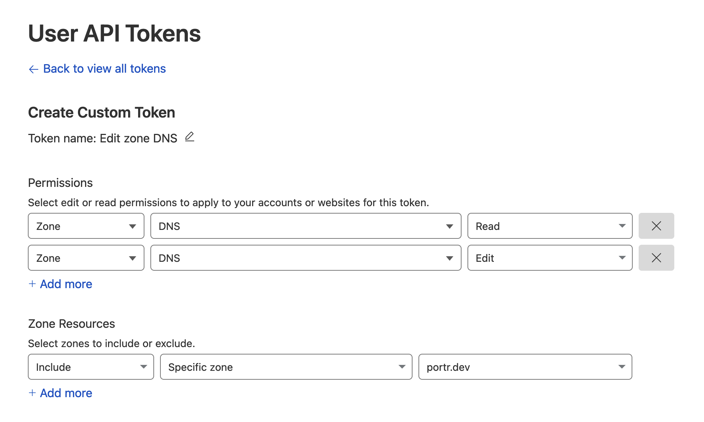

Cloudflare API token is required by caddy for provisioning SSL certificates for wildcard subdomains.

- Go to [https://dash.cloudflare.com/profile/api-tokens](https://dash.cloudflare.com/profile/api-tokens)
- Create a new token
- Set the following permissions
    - Zone - DNS - Read
    - Zone - DNS - Edit
- Set the zone resources
    - Include - Specific zone - {your domain}

